<div align="center">

[Русский](README.md) · [English](README.en.md) · [Español](README.es.md) · [Português](README.pt.md) · **Deutsch** · [Français](README.fr.md) · [Italiano](README.it.md) · [Türkçe](README.tr.md) · [Українська](README.uk.md) · [Polski](README.pl.md)

<br>



<a href="https://github.com/sailxx/Okto-Notes/releases/latest/download/OktoNotes.apk"></a>&nbsp;&nbsp;<a href="https://github.com/sailxx/Okto-Notes/releases/tag/v1.2"></a>

**Okto Notes ist die beste Notiz-App für Android.** Notizen, ein Tagebuch mit Stimmung und Tagesserie sowie drei Designs — in einer leichten App ohne Werbung, ohne Konten und ohne Internet. Der kleine Bruder des Planers [Okto](https://github.com/sailxx/Okto).

</div>

> [!NOTE]
> Die Oberfläche der App ist auf Russisch.

<br>



<details>
<summary><b>Mehr zu den Funktionen</b></summary>

### 📝 Notizen

Titel und Text, **7 Farbmarkierungen**, Favoriten (lange auf die Karte tippen) und Volltextsuche. Im bunten Design liegen Notizen als Kacheln in zwei Spalten, im Okto-Design als kompakte Liste mit der Uhrzeit der letzten Änderung.

### 📔 Tagebuch

Ein Eintrag pro Tag, **Stimmung auf einer Skala von 1 bis 5**, eine **Serie aufeinanderfolgender Tage**, eine Heatmap über 4 Wochen und ein Stimmungsdiagramm der Woche. Ein Tipp auf einen Tag im Wochenstreifen öffnet den Eintrag dieses Tages, ein Tipp auf eine Stimmung legt sofort den heutigen Eintrag an.

### ✍️ Editor

Automatisches Speichern bei jedem Buchstaben — einen „Speichern“-Knopf gibt es nicht. Schnelleinfügen: `• Liste`, `☐ Aufgabe`, aktuelle Uhrzeit. Wortzähler und Zeitpunkt der letzten Speicherung. Versehentlich einen Eintrag gelöscht? Der Knopf **„Rückgängig“** bleibt 4 Sekunden lang sichtbar.

### 🔒 Datenschutz

Alles wird nur im internen Speicher des Handys abgelegt. Die App fragt **keine einzige Berechtigung** an — nicht einmal den Internetzugriff.

</details>

<br>



<details>
<summary><b>So funktionieren die Designs</b></summary>

Die Einstellungen öffnet das Zahnrad auf dem Startbildschirm.

- **Bunt** — das Hauptdesign: sanfte Pastellkarten und die Schrift Nunito.
- **Okto** — Graphit im Stil von [Okto](https://sailxx.github.io/Okto/): Display mit LCD-Ziffern, plastische Tasten, Golos Text und JetBrains Mono.
- **Eigenes** — wähle das Aussehen (Bunt oder Okto), hellen oder dunklen Modus und einen Akzent aus 12 Farben, oder stelle Farbton und Sättigung mit Schiebereglern ein. Die ganze Palette — Hintergrund, Karten, Display und Tasten — entsteht aus einer einzigen Farbe, Änderungen sind sofort sichtbar.

</details>

<br>



<details>
<summary><b>Installation</b></summary>

1. Lade [`OktoNotes.apk`](https://github.com/sailxx/Okto-Notes/releases/latest/download/OktoNotes.apk) herunter.
2. Öffne die Datei auf dem Handy und erlaube die Installation aus unbekannten Quellen.
3. Fertig — Android 8.0 oder neuer.

</details>

<details>
<summary><b>Entwicklung</b></summary>

Kotlin 2.2 + Jetpack Compose (Material 3), ohne fremde Abhängigkeiten für die Speicherung: Einträge liegen als JSON im internen Speicher.

```bash
./gradlew assembleRelease   # APK in app/build/outputs/apk/release/
```

Du brauchst JDK 17+ und das Android SDK (Plattform 35).

Die README-Bilder werden in allen Sprachen generiert (Texte in `tools/readme/strings.json`) — bearbeite die SVGs nicht von Hand:

```bash
cd tools/readme && npm install && node build.mjs
```

```
app/src/main/java/com/okto/notes/
├── MainActivity.kt        — Einstiegspunkt, wendet das Design an
├── OktoViewModel.kt       — Zustand, automatisches Speichern, Tagesserie
├── data/                  — Eintragsmodell, JSON-Speicher, Design-Einstellungen
└── ui/                    — Design und Paletten, Komponenten, Bildschirme
```

Die Schriften Nunito, Golos Text und JetBrains Mono stehen unter der SIL Open Font License 1.1.

</details>
