<div align="center">

[Русский](README.md) · **English** · [Español](README.es.md) · [Português](README.pt.md) · [Deutsch](README.de.md) · [Français](README.fr.md) · [Italiano](README.it.md) · [Türkçe](README.tr.md) · [Українська](README.uk.md) · [Polski](README.pl.md)

<br>



<a href="https://github.com/sailxx/Okto-Notes/releases/latest/download/OktoNotes.apk"></a>&nbsp;&nbsp;<a href="https://github.com/sailxx/Okto-Notes/releases/tag/v1.2"></a>

**Okto Notes is the best notes app for Android.** Notes, a journal with moods and day streaks, and three visual themes — in one light app with no ads, no accounts and no internet. The little brother of the [Okto](https://github.com/sailxx/Okto) planner.

</div>

> [!NOTE]
> The app interface is in Russian.

<br>



<details>
<summary><b>More about the features</b></summary>

### 📝 Notes

A title and text, **7 color labels**, favorites (long-press a card) and full-text search. In the colorful theme notes are laid out as two-column tiles; in the Okto theme as a compact list with the time of the last edit.

### 📔 Journal

One entry per day, **mood on a 1–5 scale**, a **streak of days in a row**, a 4-week heat map and a weekly mood chart. Tap a day in the week strip to open that day’s entry; tap a mood to create today’s entry right away.

### ✍️ Editor

Autosave on every letter — there is no “Save” button. Quick inserts: `• list`, `☐ task`, the current time. A word counter and the time of the last save. Deleted an entry by accident? The **“Undo”** button is there for 4 seconds.

### 🔒 Privacy

Everything is stored only in the phone’s internal storage. The app asks for **zero permissions** — not even internet access.

</details>

<br>



<details>
<summary><b>How the themes work</b></summary>

Settings open with the gear on the main screen.

- **Colorful** — the main theme: soft pastel cards and the Nunito typeface.
- **Okto** — graphite in the style of [Okto](https://sailxx.github.io/Okto/): a display with LCD digits, raised keys, Golos Text and JetBrains Mono.
- **Custom** — choose the look (Colorful or Okto), light or dark mode and an accent from 12 colors, or tune the hue and saturation with sliders. The whole palette — background, cards, display and buttons — is built from a single color, and changes show up instantly.

</details>

<br>



<details>
<summary><b>Install</b></summary>

1. Download [`OktoNotes.apk`](https://github.com/sailxx/Okto-Notes/releases/latest/download/OktoNotes.apk).
2. Open the file on your phone and allow installs from unknown sources.
3. Done — Android 8.0 or newer.

</details>

<details>
<summary><b>Development</b></summary>

Kotlin 2.2 + Jetpack Compose (Material 3), no third-party storage dependencies: entries are kept as JSON in internal storage.

```bash
./gradlew assembleRelease   # APK in app/build/outputs/apk/release/
```

You need JDK 17+ and the Android SDK (platform 35).

The README images are generated in every language (texts live in `tools/readme/strings.json`) — don’t edit the SVGs by hand:

```bash
cd tools/readme && npm install && node build.mjs
```

```
app/src/main/java/com/okto/notes/
├── MainActivity.kt        — entry point, applies the theme
├── OktoViewModel.kt       — state, autosave, day streak
├── data/                  — entry model, JSON storage, theme settings
└── ui/                    — theme and palettes, components, screens
```

The Nunito, Golos Text and JetBrains Mono fonts are under the SIL Open Font License 1.1.

</details>
