<div align="center">

[Русский](README.md) · [English](README.en.md) · **Español** · [Português](README.pt.md) · [Deutsch](README.de.md) · [Français](README.fr.md) · [Italiano](README.it.md) · [Türkçe](README.tr.md) · [Українська](README.uk.md) · [Polski](README.pl.md)

<br>



<a href="https://github.com/sailxx/Okto-Notes/releases/latest/download/OktoNotes.apk"></a>&nbsp;&nbsp;<a href="https://github.com/sailxx/Okto-Notes/releases/latest"></a>

**Okto Notes es la mejor app de notas para Android.** Notas, un diario con estado de ánimo y racha de días y tres temas visuales, en una app ligera sin anuncios, sin cuentas y sin internet. El hermano pequeño del planificador [Okto](https://github.com/sailxx/Okto).

</div>

> [!NOTE]
> La interfaz de la app está en ruso.

<br>



<details>
<summary><b>Más sobre las funciones</b></summary>

### 📝 Notas

Título y texto, **7 etiquetas de color**, favoritas (pulsación larga sobre la tarjeta) y búsqueda en todo el texto. En el tema colorido las notas se muestran como mosaico en dos columnas; en el tema Okto, como una lista compacta con la hora del último cambio.

### 📔 Diario

Una entrada por día, **ánimo en una escala del 1 al 5**, **racha de días seguidos**, mapa de calor de 4 semanas y gráfico de ánimo de la semana. Un toque en un día de la franja semanal abre la entrada de ese día; un toque en el ánimo crea al momento la entrada de hoy.

### ✍️ Editor

Guardado automático en cada letra: no hay botón «Guardar». Inserciones rápidas: `• lista`, `☐ tarea`, la hora actual. Contador de palabras y hora del último guardado. ¿Borraste una entrada sin querer? El botón **«Deshacer»** aparece durante 4 segundos.

### 🔒 Privacidad

Todo se guarda solo en la memoria interna del teléfono. La app no pide **ningún permiso**, ni siquiera acceso a internet.

</details>

<br>



<details>
<summary><b>Cómo funcionan los temas</b></summary>

Los ajustes se abren con el engranaje de la pantalla principal.

- **Colorido**: el tema principal, con tarjetas en suaves tonos pastel y la tipografía Nunito.
- **Okto**: grafito al estilo de [Okto](https://sailxx.github.io/Okto/), con pantalla de cifras LCD, teclas en relieve, Golos Text y JetBrains Mono.
- **Propio**: elige el aspecto (Colorido u Okto), modo claro u oscuro y un acento entre 12 colores, o ajusta el tono y la saturación con controles deslizantes. Toda la paleta (fondo, tarjetas, pantalla y botones) se genera a partir de un solo color y los cambios se ven al instante.

</details>

<br>



<details>
<summary><b>Instalación</b></summary>

1. Descarga [`OktoNotes.apk`](https://github.com/sailxx/Okto-Notes/releases/latest/download/OktoNotes.apk).
2. Abre el archivo en el teléfono y permite la instalación de fuentes desconocidas.
3. Listo: Android 8.0 o superior.

</details>

<details>
<summary><b>Desarrollo</b></summary>

Kotlin 2.2 + Jetpack Compose (Material 3), sin dependencias externas para el almacenamiento: las entradas se guardan como JSON en la memoria interna.

```bash
./gradlew assembleRelease   # APK en app/build/outputs/apk/release/
```

Necesitas JDK 17+ y el Android SDK (plataforma 35).

Las imágenes del README se generan en todos los idiomas (los textos están en `tools/readme/strings.json`); no edites los SVG a mano:

```bash
cd tools/readme && npm install && node build.mjs
```

```
app/src/main/java/com/okto/notes/
├── MainActivity.kt        — punto de entrada, aplica el tema
├── OktoViewModel.kt       — estado, guardado automático, racha de días
├── data/                  — modelo de entrada, almacenamiento JSON, ajustes del tema
└── ui/                    — tema y paletas, componentes, pantallas
```

Las fuentes Nunito, Golos Text y JetBrains Mono tienen licencia SIL Open Font License 1.1.

</details>
