<div align="center">

[Русский](README.md) · [English](README.en.md) · [Español](README.es.md) · [Português](README.pt.md) · [Deutsch](README.de.md) · **Français** · [Italiano](README.it.md) · [Türkçe](README.tr.md) · [Українська](README.uk.md) · [Polski](README.pl.md)

<br>


<a href="https://github.com/sailxx/Okto-Notes/releases/latest/download/OktoNotes.apk"></a>&nbsp;&nbsp;<a href="https://github.com/sailxx/Okto-Notes/releases/tag/v1.2"></a>

**Okto Notes est la meilleure appli de notes sur Android.** Des notes, un journal avec humeur et série de jours, trois thèmes visuels — dans une appli légère, sans pub, sans compte et sans internet. Le petit frère de l’agenda [Okto](https://github.com/sailxx/Okto).

</div>

> [!NOTE]
> L’interface de l’appli est en russe.

<br>


<details>
<summary><b>En savoir plus sur les fonctionnalités</b></summary>

### 📝 Notes

Un titre et du texte, **7 étiquettes de couleur**, des favoris (appui long sur la carte) et une recherche dans tout le texte. Dans le thème coloré, les notes s’affichent en mosaïque sur deux colonnes ; dans le thème Okto, en liste compacte avec l’heure de la dernière modification.

### 📔 Journal

Une entrée par jour, **l’humeur sur une échelle de 1 à 5**, une **série de jours consécutifs**, une carte de chaleur sur 4 semaines et un graphique de l’humeur de la semaine. Un appui sur un jour de la bande hebdomadaire ouvre son entrée ; un appui sur une humeur crée aussitôt l’entrée du jour.

### ✍️ Éditeur

Enregistrement automatique à chaque lettre — il n’y a pas de bouton « Enregistrer ». Insertions rapides : `• liste`, `☐ tâche`, l’heure actuelle. Compteur de mots et heure du dernier enregistrement. Entrée supprimée par erreur ? Le bouton **« Annuler »** reste affiché 4 secondes.

### 🔒 Confidentialité

Tout est stocké uniquement dans la mémoire interne du téléphone. L’appli ne demande **aucune autorisation** — pas même l’accès à internet.

</details>

<br>



<details>
<summary><b>Comment fonctionnent les thèmes</b></summary>

Les réglages s’ouvrent avec la roue dentée de l’écran principal.

- **Coloré** — le thème principal : cartes aux tons pastel doux et police Nunito.
- **Okto** — graphite dans le style d’[Okto](https://sailxx.github.io/Okto/) : écran à chiffres LCD, touches en relief, Golos Text et JetBrains Mono.
- **Perso** — choisissez l’apparence (Coloré ou Okto), le mode clair ou sombre et un accent parmi 12 couleurs, ou réglez la teinte et la saturation avec des curseurs. Toute la palette — fond, cartes, écran et boutons — se construit à partir d’une seule couleur, et les changements s’affichent tout de suite.

</details>

<br>



<details>
<summary><b>Installation</b></summary>

1. Téléchargez [`OktoNotes.apk`](https://github.com/sailxx/Okto-Notes/releases/latest/download/OktoNotes.apk).
2. Ouvrez le fichier sur le téléphone et autorisez l’installation depuis des sources inconnues.
3. C’est prêt — Android 8.0 ou plus récent.

</details>

<details>
<summary><b>Développement</b></summary>

Kotlin 2.2 + Jetpack Compose (Material 3), sans dépendance externe pour le stockage : les entrées sont enregistrées en JSON dans la mémoire interne.

```bash
./gradlew assembleRelease   # APK dans app/build/outputs/apk/release/
```

Il faut le JDK 17+ et l’Android SDK (plateforme 35).

Les images du README sont générées dans toutes les langues (textes dans `tools/readme/strings.json`) — ne modifiez pas les SVG à la main :

```bash
cd tools/readme && npm install && node build.mjs
```

```
app/src/main/java/com/okto/notes/
├── MainActivity.kt        — point d’entrée, applique le thème
├── OktoViewModel.kt       — état, enregistrement automatique, série de jours
├── data/                  — modèle d’entrée, stockage JSON, réglages du thème
└── ui/                    — thème et palettes, composants, écrans
```

Les polices Nunito, Golos Text et JetBrains Mono sont sous SIL Open Font License 1.1.

</details>
