<div align="center">

[Русский](README.md) · [English](README.en.md) · [Español](README.es.md) · [Português](README.pt.md) · [Deutsch](README.de.md) · [Français](README.fr.md) · **Italiano** · [Türkçe](README.tr.md) · [Українська](README.uk.md) · [Polski](README.pl.md)

<br>



<a href="https://github.com/sailxx/Okto-Notes/releases/latest/download/OktoNotes.apk"></a>&nbsp;&nbsp;<a href="https://github.com/sailxx/Okto-Notes/releases/latest"></a>

**Okto Notes è la migliore app per le note su Android.** Note, un diario con umore e serie di giorni e quattro temi grafici, in un’app leggera senza pubblicità, senza account e senza internet. Il fratello minore del planner [Okto](https://github.com/sailxx/Okto).

</div>

> [!NOTE]
> L’interfaccia dell’app è in russo.

<br>



<details>
<summary><b>Di più sulle funzioni</b></summary>

### 📝 Note

Titolo e testo, **7 etichette colorate**, preferite (pressione lunga sulla scheda) e ricerca in tutto il testo. Nel tema colorato le note sono disposte a riquadri su due colonne, nel tema Okto in un elenco compatto con l’ora dell’ultima modifica.

### 📔 Diario

Una voce al giorno, **umore su una scala da 1 a 5**, una **serie di giorni consecutivi**, una mappa di calore su 4 settimane e un grafico dell’umore della settimana. Un tocco su un giorno nella striscia settimanale apre la voce di quel giorno; un tocco sull’umore crea subito la voce di oggi.

### ✍️ Editor

Salvataggio automatico a ogni lettera: il pulsante «Salva» non c’è. Inserimenti rapidi: `• elenco`, `☐ attività`, l’ora attuale. Contatore di parole e ora dell’ultimo salvataggio. Hai eliminato una voce per sbaglio? Il pulsante **«Annulla»** resta visibile per 4 secondi. Puoi allegare **foto e file** a note e voci del diario con i pulsanti Foto e File; gli allegati restano sul dispositivo.

### 🔒 Privacy

Tutto è salvato solo nella memoria interna del telefono. L’app non chiede **nessun permesso**, nemmeno l’accesso a internet.

</details>

<br>



<details>
<summary><b>Come funzionano i temi</b></summary>

Le impostazioni si aprono con l’ingranaggio nella schermata principale.

- **Colorato**: il tema principale, con schede in morbidi toni pastello e il font Nunito.
- **Okto**: grafite nello stile di [Okto](https://sailxx.github.io/Okto/), con display a cifre LCD, tasti in rilievo, Golos Text e JetBrains Mono.
- **Okto Light**: la versione bianca di Okto: lo stesso display e gli stessi tasti su sfondo chiaro.
- **Personale**: scegli l’aspetto (Colorato o Okto), la modalità chiara o scura e un accento tra 12 colori, oppure regola tonalità e saturazione con i cursori. L’intera palette (sfondo, schede, display e pulsanti) nasce da un solo colore e le modifiche si vedono subito.

</details>

<br>



<details>
<summary><b>Installazione</b></summary>

1. Scarica [`OktoNotes.apk`](https://github.com/sailxx/Okto-Notes/releases/latest/download/OktoNotes.apk).
2. Apri il file sul telefono e consenti l’installazione da origini sconosciute.
3. Fatto: Android 8.0 o successivo.

</details>

<details>
<summary><b>Sviluppo</b></summary>

Kotlin 2.2 + Jetpack Compose (Material 3), senza dipendenze esterne per l’archiviazione: le voci sono salvate in JSON nella memoria interna.

```bash
./gradlew assembleRelease   # APK in app/build/outputs/apk/release/
```

Servono JDK 17+ e Android SDK (piattaforma 35).

Le immagini del README vengono generate in tutte le lingue (i testi sono in `tools/readme/strings.json`): non modificare gli SVG a mano.

```bash
cd tools/readme && npm install && node build.mjs
```

```
app/src/main/java/com/okto/notes/
├── MainActivity.kt        — punto di ingresso, applica il tema
├── OktoViewModel.kt       — stato, salvataggio automatico, serie di giorni
├── data/                  — modello della voce, archivio JSON, impostazioni del tema
└── ui/                    — tema e palette, componenti, schermate
```

I font Nunito, Golos Text e JetBrains Mono sono distribuiti con licenza SIL Open Font License 1.1.

</details>
