<div align="center">

**Русский** · [English](README.en.md) · [Español](README.es.md) · [Português](README.pt.md) · [Deutsch](README.de.md) · [Français](README.fr.md) · [Italiano](README.it.md) · [Türkçe](README.tr.md) · [Українська](README.uk.md) · [Polski](README.pl.md)

<br>



<a href="https://github.com/sailxx/Okto-Notes/releases/latest/download/OktoNotes.apk"></a>&nbsp;&nbsp;<a href="https://github.com/sailxx/Okto-Notes/releases/latest"></a>

**Okto Notes — лучшее приложение для заметок на Android.** Заметки, дневник с настроением и серией дней, четыре темы оформления — в одном лёгком приложении без рекламы, аккаунтов и интернета. Младший брат планера [Okto](https://github.com/sailxx/Okto).

</div>

<br>



<details>
<summary><b>Подробнее о возможностях</b></summary>

### 📝 Заметки

Заголовок и текст, **7 цветных меток**, избранное (долгое нажатие на карточку) и поиск по всему тексту. В цветной теме заметки лежат плиткой в две колонки, в теме Okto — компактным списком с временем изменения.

### 📔 Дневник

Одна запись на день, **настроение по шкале 1–5**, **серия дней подряд**, тепловая карта за 4 недели и график настроения за неделю. Тап по дню в недельной полосе открывает запись за этот день, тап по настроению — сразу создаёт запись на сегодня.

### ✍️ Редактор

Автосохранение на каждой букве — кнопки «Сохранить» нет. Быстрые вставки: `• список`, `☐ задача`, текущее время. Счётчик слов и время последнего сохранения. Случайно удалил запись — кнопка **«Вернуть»** в течение 4 секунд. К заметкам и записям дневника можно прикреплять **фото и файлы** — кнопки «Фото» и «Файл»; вложения хранятся только на телефоне.

### 🔒 Приватность

Всё хранится только во внутренней памяти телефона. Приложение не запрашивает **ни одного разрешения** — даже доступа в интернет.

</details>

<br>



<details>
<summary><b>Как работают темы</b></summary>

Настройки открываются шестерёнкой на главном экране.

- **Цветная** — основная тема: мягкие пастельные карточки, шрифт Nunito.
- **Okto** — графит в стиле [Okto](https://sailxx.github.io/Okto/): табло с LCD-цифрами, объёмные клавиши, Golos Text и JetBrains Mono.
- **Okto Light** — белая версия Okto: те же табло и клавиши на светлом фоне.
- **Своя** — выбери оформление (Цветное или Okto), светлый или тёмный режим и акцент из 12 цветов, либо подбери оттенок и насыщенность ползунками. Вся палитра — фон, карточки, табло и кнопки — строится из одного цвета, изменения видны сразу.

</details>

<br>



<details>
<summary><b>Установка</b></summary>

1. Скачай [`OktoNotes.apk`](https://github.com/sailxx/Okto-Notes/releases/latest/download/OktoNotes.apk).
2. Открой файл на телефоне и разреши установку из неизвестных источников.
3. Готово — Android 8.0 и новее.

</details>

<details>
<summary><b>Разработка</b></summary>

Kotlin 2.2 + Jetpack Compose (Material 3), без сторонних зависимостей для хранения: записи лежат в JSON во внутренней памяти.

```bash
./gradlew assembleRelease   # APK в app/build/outputs/apk/release/
```

Нужны JDK 17+ и Android SDK (platform 35).

Картинки README генерируются на всех языках (тексты — в `tools/readme/strings.json`), не правь SVG руками:

```bash
cd tools/readme && npm install && node build.mjs
```

```
app/src/main/java/com/okto/notes/
├── MainActivity.kt        — точка входа, применение темы
├── OktoViewModel.kt       — состояние, автосохранение, серия дней
├── data/                  — модель записи, JSON-хранилище, настройки темы
└── ui/                    — тема и палитры, компоненты, экраны
```

Шрифты Nunito, Golos Text и JetBrains Mono — SIL Open Font License 1.1.

</details>
