<div align="center">

[Русский](README.md) · [English](README.en.md) · [Español](README.es.md) · [Português](README.pt.md) · [Deutsch](README.de.md) · [Français](README.fr.md) · [Italiano](README.it.md) · [Türkçe](README.tr.md) · [Українська](README.uk.md) · **Polski**

<br>



<a href="https://github.com/sailxx/Okto-Notes/releases/latest/download/OktoNotes.apk"></a>&nbsp;&nbsp;<a href="https://github.com/sailxx/Okto-Notes/releases/latest"></a>

**Okto Notes to najlepsza aplikacja do notatek na Androida.** Notatki, dziennik z nastrojem i serią dni oraz trzy motywy wyglądu — w jednej lekkiej aplikacji bez reklam, kont i internetu. Młodszy brat planera [Okto](https://github.com/sailxx/Okto).

</div>

> [!NOTE]
> Interfejs aplikacji jest po rosyjsku.

<br>



<details>
<summary><b>Więcej o funkcjach</b></summary>

### 📝 Notatki

Tytuł i tekst, **7 kolorowych etykiet**, ulubione (długie przytrzymanie karty) i wyszukiwanie w całym tekście. W kolorowym motywie notatki układają się w kafelki w dwóch kolumnach, w motywie Okto — w zwartą listę z godziną ostatniej zmiany.

### 📔 Dziennik

Jeden wpis dziennie, **nastrój w skali 1–5**, **seria dni z rzędu**, mapa cieplna z 4 tygodni i wykres nastroju z tygodnia. Dotknięcie dnia na pasku tygodnia otwiera wpis z tego dnia, a dotknięcie nastroju od razu tworzy wpis na dziś.

### ✍️ Edytor

Autozapis przy każdej literze — przycisku „Zapisz” nie ma. Szybkie wstawki: `• lista`, `☐ zadanie`, bieżąca godzina. Licznik słów i godzina ostatniego zapisu. Przypadkiem usunięty wpis? Przycisk **„Cofnij”** jest dostępny przez 4 sekundy.

### 🔒 Prywatność

Wszystko jest przechowywane tylko w pamięci wewnętrznej telefonu. Aplikacja nie prosi o **żadne uprawnienia** — nawet o dostęp do internetu.

</details>

<br>



<details>
<summary><b>Jak działają motywy</b></summary>

Ustawienia otwiera koło zębate na ekranie głównym.

- **Kolorowy** — główny motyw: miękkie pastelowe karty i krój Nunito.
- **Okto** — grafit w stylu [Okto](https://sailxx.github.io/Okto/): wyświetlacz z cyframi LCD, wypukłe klawisze, Golos Text i JetBrains Mono.
- **Własny** — wybierz wygląd (Kolorowy lub Okto), tryb jasny lub ciemny i akcent spośród 12 kolorów albo dobierz odcień i nasycenie suwakami. Cała paleta — tło, karty, wyświetlacz i przyciski — powstaje z jednego koloru, a zmiany widać od razu.

</details>

<br>



<details>
<summary><b>Instalacja</b></summary>

1. Pobierz [`OktoNotes.apk`](https://github.com/sailxx/Okto-Notes/releases/latest/download/OktoNotes.apk).
2. Otwórz plik na telefonie i zezwól na instalację z nieznanych źródeł.
3. Gotowe — Android 8.0 lub nowszy.

</details>

<details>
<summary><b>Rozwój</b></summary>

Kotlin 2.2 + Jetpack Compose (Material 3), bez zewnętrznych zależności do przechowywania: wpisy leżą w JSON w pamięci wewnętrznej.

```bash
./gradlew assembleRelease   # APK w app/build/outputs/apk/release/
```

Potrzebujesz JDK 17+ i Android SDK (platforma 35).

Obrazki README są generowane we wszystkich językach (teksty w `tools/readme/strings.json`) — nie edytuj SVG ręcznie:

```bash
cd tools/readme && npm install && node build.mjs
```

```
app/src/main/java/com/okto/notes/
├── MainActivity.kt        — punkt wejścia, stosowanie motywu
├── OktoViewModel.kt       — stan, autozapis, seria dni
├── data/                  — model wpisu, magazyn JSON, ustawienia motywu
└── ui/                    — motyw i palety, komponenty, ekrany
```

Czcionki Nunito, Golos Text i JetBrains Mono są objęte licencją SIL Open Font License 1.1.

</details>
