<div align="center">

[Русский](README.md) · [English](README.en.md) · [Español](README.es.md) · **Português** · [Deutsch](README.de.md) · [Français](README.fr.md) · [Italiano](README.it.md) · [Türkçe](README.tr.md) · [Українська](README.uk.md) · [Polski](README.pl.md)

<br>


<a href="https://github.com/sailxx/Okto-Notes/releases/latest/download/OktoNotes.apk"></a>&nbsp;&nbsp;<a href="https://github.com/sailxx/Okto-Notes/releases/latest"></a>

**Okto Notes é o melhor app de notas para Android.** Notas, um diário com humor e sequência de dias e quatro temas visuais — em um app leve, sem anúncios, sem contas e sem internet. O irmão mais novo do planejador [Okto](https://github.com/sailxx/Okto).

</div>

> [!NOTE]
> A interface do app está em russo.

<br>



<details>
<summary><b>Mais sobre os recursos</b></summary>

### 📝 Notas

Título e texto, **7 etiquetas coloridas**, favoritas (toque longo no cartão) e busca em todo o texto. No tema colorido as notas ficam em blocos de duas colunas; no tema Okto, em uma lista compacta com a hora da última alteração.

### 📔 Diário

Uma entrada por dia, **humor numa escala de 1 a 5**, **sequência de dias seguidos**, mapa de calor de 4 semanas e gráfico de humor da semana. Tocar em um dia na faixa da semana abre a entrada desse dia; tocar no humor cria na hora a entrada de hoje.

### ✍️ Editor

Salvamento automático a cada letra — não existe botão “Salvar”. Inserções rápidas: `• lista`, `☐ tarefa`, a hora atual. Contador de palavras e hora do último salvamento. Apagou uma entrada sem querer? O botão **“Desfazer”** fica disponível por 4 segundos. Dá para anexar **fotos e arquivos** a notas e entradas do diário com os botões Foto e Arquivo; os anexos ficam no aparelho.

### 🔒 Privacidade

Tudo fica guardado só na memória interna do celular. O app não pede **nenhuma permissão** — nem acesso à internet.

</details>

<br>



<details>
<summary><b>Como funcionam os temas</b></summary>

As configurações abrem pela engrenagem na tela principal.

- **Colorido** — o tema principal: cartões em tons pastel suaves e a fonte Nunito.
- **Okto** — grafite no estilo do [Okto](https://sailxx.github.io/Okto/): visor com dígitos LCD, teclas em relevo, Golos Text e JetBrains Mono.
- **Okto Light** — a versão branca do Okto: o mesmo visor e as mesmas teclas sobre fundo claro.
- **Próprio** — escolha o visual (Colorido ou Okto), modo claro ou escuro e um destaque entre 12 cores, ou ajuste o tom e a saturação nos controles deslizantes. Toda a paleta — fundo, cartões, visor e botões — é gerada a partir de uma única cor, e as mudanças aparecem na hora.

</details>

<br>



<details>
<summary><b>Instalação</b></summary>

1. Baixe o [`OktoNotes.apk`](https://github.com/sailxx/Okto-Notes/releases/latest/download/OktoNotes.apk).
2. Abra o arquivo no celular e permita a instalação de fontes desconhecidas.
3. Pronto — Android 8.0 ou mais recente.

</details>

<details>
<summary><b>Desenvolvimento</b></summary>

Kotlin 2.2 + Jetpack Compose (Material 3), sem dependências externas para armazenamento: as entradas ficam em JSON na memória interna.

```bash
./gradlew assembleRelease   # APK em app/build/outputs/apk/release/
```

Você precisa do JDK 17+ e do Android SDK (plataforma 35).

As imagens do README são geradas em todos os idiomas (os textos ficam em `tools/readme/strings.json`) — não edite os SVG à mão:

```bash
cd tools/readme && npm install && node build.mjs
```

```
app/src/main/java/com/okto/notes/
├── MainActivity.kt        — ponto de entrada, aplica o tema
├── OktoViewModel.kt       — estado, salvamento automático, sequência de dias
├── data/                  — modelo de entrada, armazenamento JSON, configurações de tema
└── ui/                    — tema e paletas, componentes, telas
```

As fontes Nunito, Golos Text e JetBrains Mono estão sob a SIL Open Font License 1.1.

</details>
