<div align="center">

[Русский](README.md) · [English](README.en.md) · [Español](README.es.md) · [Português](README.pt.md) · [Deutsch](README.de.md) · [Français](README.fr.md) · [Italiano](README.it.md) · **Türkçe** · [Українська](README.uk.md) · [Polski](README.pl.md)

<br>



<a href="https://github.com/sailxx/Okto-Notes/releases/latest/download/OktoNotes.apk"></a>&nbsp;&nbsp;<a href="https://github.com/sailxx/Okto-Notes/releases/latest"></a>

**Okto Notes, Android için en iyi not uygulamasıdır.** Notlar, ruh hali ve gün serisi olan bir günlük ve dört görünüm teması — reklamsız, hesapsız ve internetsiz tek bir hafif uygulamada. [Okto](https://github.com/sailxx/Okto) planlayıcısının küçük kardeşi.

</div>

> [!NOTE]
> Uygulamanın arayüzü Rusçadır.

<br>



<details>
<summary><b>Özellikler hakkında daha fazlası</b></summary>

### 📝 Notlar

Başlık ve metin, **7 renkli etiket**, favoriler (karta uzun basın) ve tüm metinde arama. Renkli temada notlar iki sütunlu kutucuklar hâlinde, Okto temasında ise son değişiklik saatiyle kompakt bir liste hâlinde durur.

### 📔 Günlük

Günde bir kayıt, **1–5 ölçeğinde ruh hali**, **art arda gün serisi**, 4 haftalık ısı haritası ve haftalık ruh hali grafiği. Haftalık şeritte bir güne dokunmak o günün kaydını açar; bir ruh haline dokunmak bugünün kaydını hemen oluşturur.

### ✍️ Düzenleyici

Her harfte otomatik kayıt — “Kaydet” düğmesi yok. Hızlı eklemeler: `• liste`, `☐ görev`, şimdiki saat. Kelime sayacı ve son kayıt saati. Bir kaydı yanlışlıkla mı sildiniz? **“Geri al”** düğmesi 4 saniye boyunca ekranda kalır. Notlara ve günlük kayıtlarına Fotoğraf ve Dosya düğmeleriyle **fotoğraf ve dosya** ekleyebilirsin; ekler yalnızca cihazda kalır.

### 🔒 Gizlilik

Her şey yalnızca telefonun dahili belleğinde saklanır. Uygulama **hiçbir izin** istemez — internet erişimi bile.

</details>

<br>



<details>
<summary><b>Temalar nasıl çalışır</b></summary>

Ayarlar ana ekrandaki dişli simgesiyle açılır.

- **Renkli** — ana tema: yumuşak pastel kartlar ve Nunito yazı tipi.
- **Okto** — [Okto](https://sailxx.github.io/Okto/) tarzında grafit: LCD rakamlı ekran, kabarık tuşlar, Golos Text ve JetBrains Mono.
- **Okto Light** — Okto’nun beyaz sürümü: aynı ekran ve tuşlar, açık zemin üzerinde.
- **Özel** — görünümü (Renkli veya Okto), açık ya da koyu modu ve 12 renk arasından bir vurgu rengini seçin ya da tonu ve doygunluğu kaydırıcılarla ayarlayın. Tüm palet — arka plan, kartlar, ekran ve düğmeler — tek bir renkten oluşturulur, değişiklikler anında görünür.

</details>

<br>



<details>
<summary><b>Kurulum</b></summary>

1. [`OktoNotes.apk`](https://github.com/sailxx/Okto-Notes/releases/latest/download/OktoNotes.apk) dosyasını indirin.
2. Dosyayı telefonda açın ve bilinmeyen kaynaklardan yüklemeye izin verin.
3. Hazır — Android 8.0 veya daha yenisi.

</details>

<details>
<summary><b>Geliştirme</b></summary>

Kotlin 2.2 + Jetpack Compose (Material 3), depolama için harici bağımlılık yok: kayıtlar dahili bellekte JSON olarak tutulur.

```bash
./gradlew assembleRelease   # APK: app/build/outputs/apk/release/
```

JDK 17+ ve Android SDK (platform 35) gerekir.

README görselleri tüm dillerde oluşturulur (metinler `tools/readme/strings.json` dosyasında) — SVG'leri elle düzenlemeyin:

```bash
cd tools/readme && npm install && node build.mjs
```

```
app/src/main/java/com/okto/notes/
├── MainActivity.kt        — giriş noktası, temayı uygular
├── OktoViewModel.kt       — durum, otomatik kayıt, gün serisi
├── data/                  — kayıt modeli, JSON depolama, tema ayarları
└── ui/                    — tema ve paletler, bileşenler, ekranlar
```

Nunito, Golos Text ve JetBrains Mono yazı tipleri SIL Open Font License 1.1 kapsamındadır.

</details>
