<div align="center">

[Русский](README.md) · [English](README.en.md) · [Español](README.es.md) · [Português](README.pt.md) · [Deutsch](README.de.md) · [Français](README.fr.md) · [Italiano](README.it.md) · [Türkçe](README.tr.md) · **Українська** · [Polski](README.pl.md)

<br>



<a href="https://github.com/sailxx/Okto-Notes/releases/latest/download/OktoNotes.apk"></a>&nbsp;&nbsp;<a href="https://github.com/sailxx/Okto-Notes/releases/latest"></a>

**Okto Notes — найкращий застосунок для нотаток на Android.** Нотатки, щоденник із настроєм і серією днів, чотири теми оформлення — в одному легкому застосунку без реклами, акаунтів та інтернету. Молодший брат планера [Okto](https://github.com/sailxx/Okto).

</div>

> [!NOTE]
> Інтерфейс застосунку — російською мовою.

<br>



<details>
<summary><b>Докладніше про можливості</b></summary>

### 📝 Нотатки

Заголовок і текст, **7 кольорових міток**, обране (довге натискання на картку) і пошук по всьому тексту. У кольоровій темі нотатки лежать плиткою у дві колонки, у темі Okto — компактним списком із часом зміни.

### 📔 Щоденник

Один запис на день, **настрій за шкалою 1–5**, **серія днів поспіль**, теплова карта за 4 тижні й графік настрою за тиждень. Дотик до дня в тижневій смузі відкриває запис за цей день, дотик до настрою — одразу створює запис на сьогодні.

### ✍️ Редактор

Автозбереження на кожній літері — кнопки «Зберегти» немає. Швидкі вставки: `• список`, `☐ завдання`, поточний час. Лічильник слів і час останнього збереження. Випадково видалили запис — кнопка **«Повернути»** протягом 4 секунд. До нотаток і записів щоденника можна прикріплювати **фото й файли** — кнопки «Фото» і «Файл»; вкладення зберігаються лише на пристрої.

### 🔒 Приватність

Усе зберігається лише у внутрішній пам’яті телефона. Застосунок не запитує **жодного дозволу** — навіть доступу до інтернету.

</details>

<br>



<details>
<summary><b>Як працюють теми</b></summary>

Налаштування відкриваються шестернею на головному екрані.

- **Кольорова** — основна тема: м’які пастельні картки, шрифт Nunito.
- **Okto** — графіт у стилі [Okto](https://sailxx.github.io/Okto/): табло з LCD-цифрами, об’ємні клавіші, Golos Text і JetBrains Mono.
- **Okto Light** — біла версія Okto: те саме табло й клавіші на світлому тлі.
- **Своя** — оберіть оформлення (Кольорове або Okto), світлий чи темний режим і акцент із 12 кольорів або підберіть відтінок і насиченість повзунками. Уся палітра — фон, картки, табло й кнопки — будується з одного кольору, зміни видно одразу.

</details>

<br>



<details>
<summary><b>Встановлення</b></summary>

1. Завантажте [`OktoNotes.apk`](https://github.com/sailxx/Okto-Notes/releases/latest/download/OktoNotes.apk).
2. Відкрийте файл на телефоні й дозвольте встановлення з невідомих джерел.
3. Готово — Android 8.0 і новіші.

</details>

<details>
<summary><b>Розробка</b></summary>

Kotlin 2.2 + Jetpack Compose (Material 3), без сторонніх залежностей для зберігання: записи лежать у JSON у внутрішній пам’яті.

```bash
./gradlew assembleRelease   # APK в app/build/outputs/apk/release/
```

Потрібні JDK 17+ і Android SDK (platform 35).

Картинки README генеруються всіма мовами (тексти — у `tools/readme/strings.json`), не редагуйте SVG вручну:

```bash
cd tools/readme && npm install && node build.mjs
```

```
app/src/main/java/com/okto/notes/
├── MainActivity.kt        — точка входу, застосування теми
├── OktoViewModel.kt       — стан, автозбереження, серія днів
├── data/                  — модель запису, JSON-сховище, налаштування теми
└── ui/                    — тема й палітри, компоненти, екрани
```

Шрифти Nunito, Golos Text і JetBrains Mono — SIL Open Font License 1.1.

</details>
